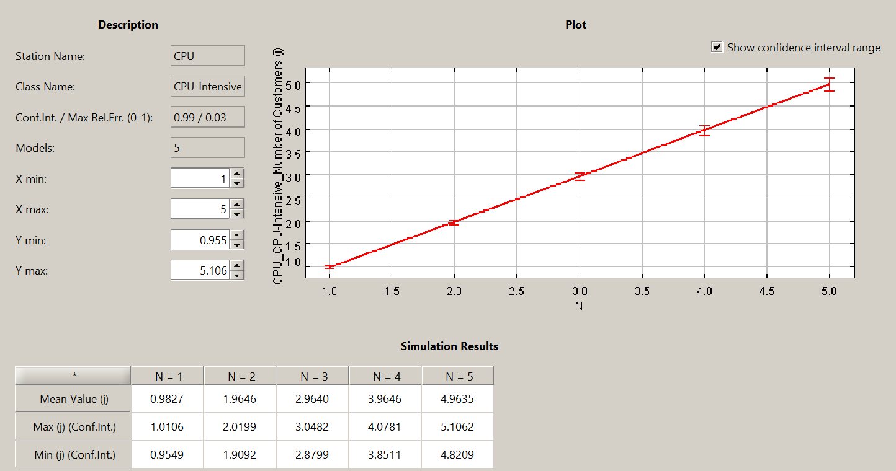
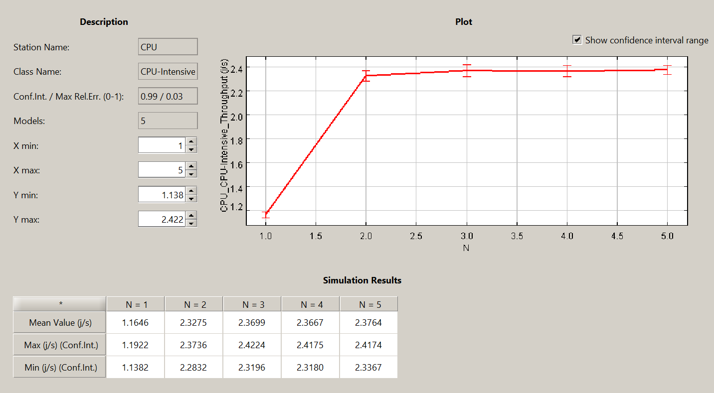
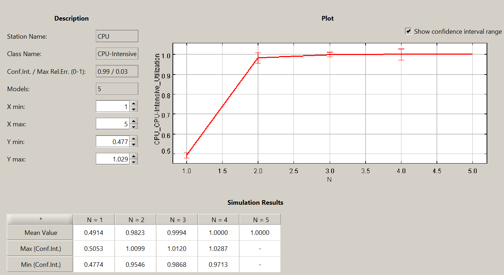
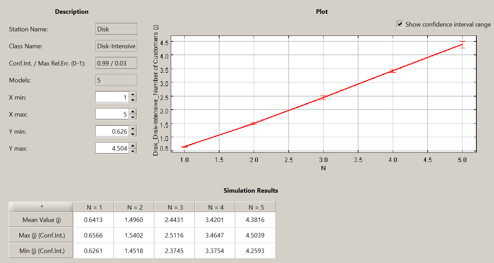
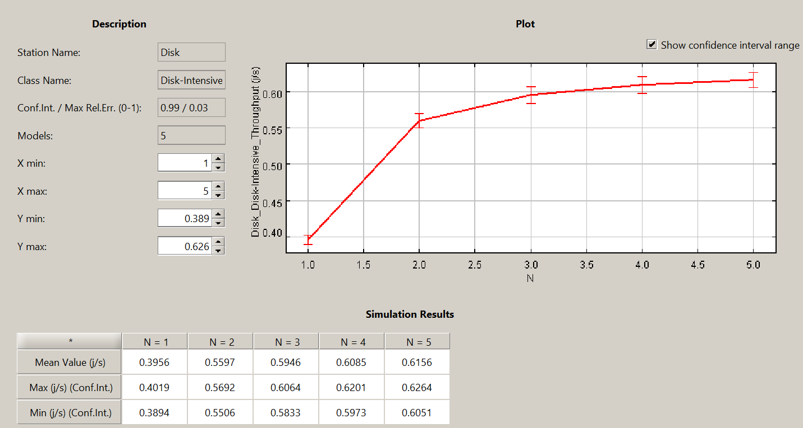
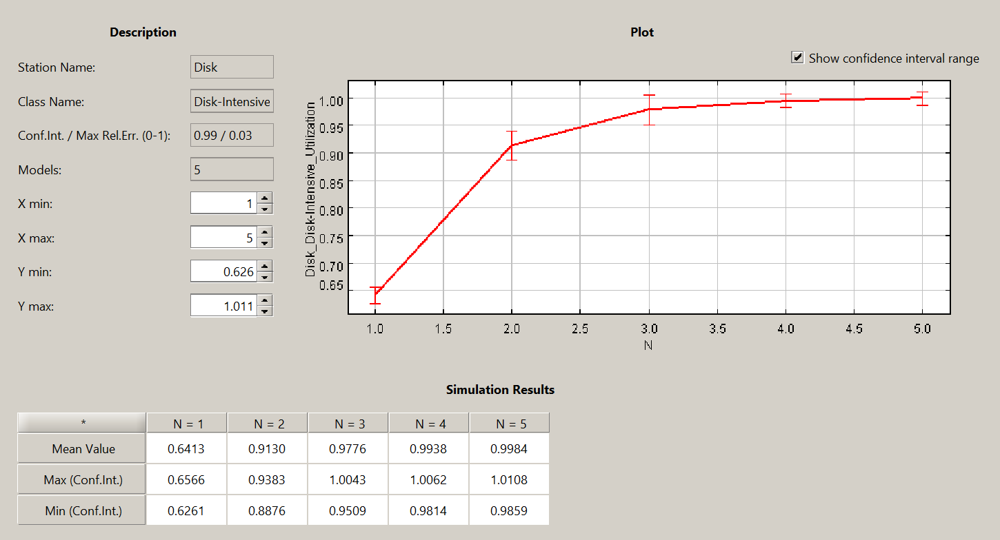

# Progetto di Capacity Planning - Tecnologie e Architetture per la Gestione dei Dati

# Indice
  - [Introduzione](#introduzione)
  - [Punto 1 - Analisi delle prestazioni della macchina reale](#punto-1---analisi-delle-prestazioni-della-macchina-reale)
  - [Punto 2 - Confronto delle prestazioni rispetto a un modello simulativo](#punto-2---confronto-delle-prestazioni-rispetto-a-un-modello-simulativo)
  - [Punto 3 - Predizione delle prestazioni tramite il modello simulativo](#punto-3---predizione-delle-prestazioni-tramite-il-modello-simulativo)
  - [Punto 4 - Analisi what-if e dimensionamento di un sistema modellato tramite reti chiuse](#punto-4---analisi-what-if-e-dimensionamento-di-un-sistema-modellato-tramite-reti-chiuse)
    - [Punto 4a - Soddisfacimento di specifiche progettuali](#punto-4a---soddisfacimento-di-specifiche-progettuali)
  - [Punto 5 - Dimensionamento di un sistema modellato tramite reti aperte](#punto-5---dimensionamento-di-un-sistema-modellato-tramite-reti-aperte)

## Introduzione

In questo documento viene presentato il lavoro svolto in merito al progetto di capacity planning per il corso di Tecnologie e Architetture per la Gestione dei Dati, anno accademico 2023-2024.

Il lavoro qui presente è stato svolto dagli studenti:
- Alessandro Di Girolamo
- Alberto Tontoni

Le attività svolte hanno previsto l'utilizzo degli strumenti Java Modeling Tools (JMT) e Benchbase per il dimensionamento di un DBMS PostgreSQL. E' stato utilizzato un computer fisso al fine di eseguire numerosi benchmark tramite Benchbase, utilizzando un fattore di scala pari a 2, i cui risultati sono stati confrontati con quanto predetto da modelli simulativi realizzati tramite JMT. Di seguito sono riportate le specifiche tecniche della macchina utilizzata:
- CPU: AMD Ryzen 7 5800X 8-Core Processor
- RAM: 16 GB, DDR4 3200 MHz
- Unità disco: SSD 1TB NVMe 1.4 PCIe con velocità di lettura fino a 7300MB/s
- Sistema operativo: Windows 10

Al fine di rendere più agevole lo sviluppo dei punti del progetto, sono stati realizzati degli script di utilità per determinare, ad esempio e nel modo più automatizzato possibile, i workload rispettivamente CPU-Intensive e Disk-Intensive. Tali script sono disponibili per la consultazione insieme ai file contenenti le statistiche dei benchmark all'indirizzo di seguito specificato.

**Link al repository github**: https://github.com/tontonialberto/tagd-project

## Punto 1 - Analisi delle prestazioni della macchina reale

Dopo aver configurato il database Postgres e l'ambiente WSL come richiesto, è stato possibile lanciare l'esecuzione del benchmark TPC-H comprensivo di tutte le 22 query offerte da quest'ultimo. La configurazione utilizzata ha previsto l'esecuzione seriale per 2000 secondi (circa mezz'ora) concludendosi con una media di 43 query eseguite per ciascuna tipologia.

Tramite l'ausilio del notebook [`stats_reader.ipynb`](https://github.com/tontonialberto/tagd-project/tree/main/scripts) è stato possibile analizzare le statistiche contenute nel file [`pg_stat_statements_1_2000s.csv`](https://github.com/tontonialberto/tagd-project/tree/main/statistics) al fine di individuare i workload CPU-Intensive e Disk-Intensive. L'individuazione delle query di interesse ha richiesto i seguenti passaggi:
- calcolo del **tempo medio di esecuzione** per ogni query, escludendo gli outliers in una certa misura:
  $$
  \bar{T} = (T_e - t_M- t_m) / (C - 2)
  $$
  dove $\bar{T}$ è il tempo medio di esecuzione, $T_e$ il tempo totale di esecuzione, $t_M$ e $t_m$ sono rispettivamente tempo massimo e tempo minimo di esecuzione, $C$ è il numero di invocazioni della query in questione nell'intervallo temporale considerato;
- calcolo del **service demand** della CPU e del disco per ogni query:
    $$
    D_c = \bar{T} - ((B_r + B_w) / C)\\
    $$

    $$
    D_d = \bar{T} - D_c
    $$

  dove rispettivamente $D_d$ e $D_c$ sono i service demand del disco e della cpu, mentre $B_r$ e $B_r$ sono i tempi di lettura e scrittura totali del disco;
- calcolo del **rapporto tra service demand della cpu e quello del disco**:
  
  $$
  R = D_c/D_d
  $$
    
    Questo ultimo calcolo ci ha permesso di individuare come query CPU-Intensive quella con il massimo valore di $R$ (nel nostro caso, $R = 57$ circa), e come Disk-Intensive quella con il valore minimo ($R = 0.54$ circa).

Detto ciò, vengono riportate le due query così individuate:
- **CPU-Intensive**:
    - Nome: Q16
    - $D_c = 0.8418712777657399s$
    - $D_d = 0.01474560369767442s$
- **Disk-Intensive**:
    - Nome: Q7
    - $D_c = 0.8933116159835509s$
    - $D_d = 1.630294817162791s$

A questo punto, è stato eseguito un benchmark separato per ciascuna delle due query individuate. E' stato considerato un tempo di esecuzione di 300 secondi per ciascun benchmark e le statistiche sul throughput sono state estratte dal file JSON "summary" prodotto da Benchbase, mentre le altre statistiche sono state estratte dalla vista `pg_stat_statements`.

!!! E' stato considerato il goodput, anzichè il throughput, di suddetto file 'summary'.

A partire da service demand $D$ e throughput $X$ così ottenuti, e sapendo che il numero medio di job $N$ nel sistema è pari a 1, è stato possibile derivare l'utilizzazione $U$ e il tempo di risposta $T_r$ tramite le formule seguenti:
- Legge del service demand: $U = X \cdot D$
- Legge di Little: $T_r = \frac{N}{X}$

Per ciascuna delle query in questione riportiamo le rispettive grandezze.

Query *CPU-Intensive*:
- $X = 1.1428574273565018 \space req/s$
- $D_c = 0.873331s$
- $D_d = 0.003121s$
- $U_c = 99.8\%$
- $U_d = 0.35\%$
- $T_r = 0.8749997821802326s$
- Files delle statistiche per consultazione: [`pg_stat_statements_1_16_300s.csv`](https://github.com/tontonialberto/tagd-project/tree/main/statistics), [`CPUint_summary.json`](https://github.com/tontonialberto/tagd-project/tree/main/statistics)
  
Query *Disk-Intensive*:
- $X = 0.4119602231342898 \space req/s$
- $D_c = 0.900671s$
- $D_d = 1.54916s$
- $U_c = 37.1\%$
- $U_d = 63.8\%$
- $T_r = 2.4274188230887095s$
- Files delle statistiche per consultazione: [`pg_stat_statements_1_7_300s.csv`](https://github.com/tontonialberto/tagd-project/tree/main/statistics), [`DISKint_summary.json`](https://github.com/tontonialberto/tagd-project/tree/main/statistics)

E' scontato che la CPU e il disco siano il collo di bottiglia, rispettivamente, per la query CPU-Intensive e per quella Disk-Intensive. Tuttavia è possibile fare delle considerazioni più accurate: l'utilizzazione della CPU è quasi al massimo nella query CPU-Intensive, dunque il sistema è in saturazione. Cio' non si verifica per il carico Disk-Intensive, in quanto l'unità disco è utilizzata solo al 64%, un livello accettabile di utilizzazione delle risorse.

## Punto 2 - Confronto delle prestazioni rispetto a un modello simulativo

Tramite JMT è stato realizzato un modello simulativo concernente le due classi di workload individuate. Per la modellazione di suddetta rete chiusa sono stati utilizzati i service demand presentati al Punto 1.

A seguire delle tabelle di comparazione dei risultati tra il sistema reale e il modello utilizzante un singolo job per ciascuna classe di workload.

Per la query *CPU-Intensive*:
|                                | Modello simulativo | Sistema reale |
| ------------------------------ | ------------------ | ------------- |
| Throughput del sistema (req/s) | 1.1669             | 1.142         |
| Utilizzazione CPU (%)          | 98.31              | 99.8          |
| Utilizzazione Disco  (%)        | 1.72               | 0.35          |

Per la query *Disk-Intensive*:
|                                | Modello simulativo | Sistema reale |
| ------------------------------ | ------------------ | ------------- |
| Throughput del sistema (req/s) | 0.3956             | 0.4119        |
| Utilizzazione CPU (%)          | 35.7               | 37.1          |
| Utilizzazione Disco  (%)        | 64.8               | 63.8          |

Possiamo dunque ritenere il modello sufficientemente accurato e rappresentativo del sistema reale considerato finora. Il file di suddetto modello è consultabile accedendo al repository del progetto: [`punto1.jmva.jsimg`](https://github.com/tontonialberto/tagd-project/tree/main/models).

## Punto 3 - Predizione delle prestazioni tramite il modello simulativo

Impostando il parametro `terminals` pari a 2 nel file di configurazione di benchbase, sono stati eseguiti nuovamente, per 300 secondi ciascuno, i benchmark relativi alle due classi di workload, al fine di valutare le prestazioni con un numero di query concorrenti pari a 2.

Le nostre considerazioni a priori ci fanno supporre che il throughput del carico CPU-Intensive non possa aumentare per via delle considerazioni fatte ai Punti 1 e 2. Invece dal carico Disk-Intensive ci si potrebbe aspettare un aumento del throughput in quanto l'attuale collo di bottiglia, il disco, non è ancora giunto a saturazione.

A seguire le tabelle di comparazione tra il sistema reale e il modello simulativo precedentemente sviluppato, con un numero di customers pari a 2.

Per la query *CPU-Intensive*:
|                                   | Modello simulativo | Sistema reale |
| --------------------------------- | ------------------ | ------------- |
| Throughput del sistema (req/s)    | 1.1865             | 1.1295        |
| Utilizzazione CPU (%)             | 99.98              | 99            |
| Utilizzazione Disco  (%)           | 1.76               | 0.63          |
| Tempo di risposta del sistema (s) | 1.7736             | 1.7705        |

Per la query *Disk-Intensive*:
|                                   | Modello simulativo | Sistema reale |
| --------------------------------- | ------------------ | ------------- |
| Throughput del sistema (req/s)    | 0.5152             | 0.6445        |
| Utilizzazione CPU (%)             | 45.9               | 37            |
| Utilizzazione Disco  (%)           | 83.85              | 62.1          |
| Tempo di risposta del sistema (s) | 2.6615             | 3.1031        |

Come atteso, le previsioni del modello confermano la saturazione preannunciata per il workload CPU-Intensive (il throughput aumenta in modo trascurabile rispetto al caso con un solo job) e l'apprezzabile incremento di throughput per il carico Disk-Intensive (con il collo di bottiglia che passa da un'utilizzazione del 64.8% con un solo job all'83.85% con due job).

Si può notare come le previsioni per il carico CPU-Intensive continuino ad essere accurate, mentre ciò non accade per il carico Disk-Intensive: con 2 job, infatti, l'utilizzazione reale del disco è oltre 20 punti percentuali inferiore a quanto predetto dal modello. Riteniamo che ciò sia ritenuto alla tecnologia NVMe utilizzata dall'unità disco del sistema reale, la quale è in grado di ottimizzare alcune operazioni di lettura/scrittura permettendo di mantenere un'utilizzazione del disco relativamente bassa. Tuttavia questa è un'ipotesi per esclusione a seguito di diversi esperimenti e ricerche.

Ad ogni modo, riteniamo che il modello simulativo sia da ritenersi affidabile per lo svolgimento dei punti successivi; cio' è principalmente motivato dall'accuratezza dei risultati ottenuti nelle sezioni precedenti.

## Punto 4 - Analisi what-if e dimensionamento di un sistema modellato tramite reti chiuse

Viene ora utilizzato il modello simulativo per effettuare previsioni sulle prestazioni della macchina reale qualora si utilizzino 2 CPU e al variare del numero di query concorenti da 1 a 5.

A seguire una serie di schermate dell'analisi *What-If* condotta tramite JMT per la query *CPU-Intensive*. Vengono mostrati nell'ordine, unicamente per il collo di bottiglia (CPU), gli andamenti del numero medio di clienti nel centro, del throughput e dell'utilizzazione.

 

Come atteso, superato un numero di *customers* pari a 2, la CPU va in saturazione: con 3 *customers* l'utilizzazione è circa pari al 100%. Il throughput aumenta rapidamente fino a 2 *customers* con un valore pari a $X = 2.3 \space req/s$, per poi salire di molto poco (di 0.1 circa) fino a completa saturazione all'ulteriore aumentare di job/customers nel sistema.

A seguire gli andamenti, rispetto al collo di bottiglia (Disco), nel caso della query *Disk-Intensive*.

 

Il disco arriva a quasi saturazione con 3 *customers* (con utilizzazione del 97% circa) e un throughput che fino a 2 *customers* sale rapidamente fino a $X=0.56 \space req/s$ circa, per poi salire progressivamente in modo più lento, fino a raggiungere la saturazione con 4-5 customers.

A verifica della bontà delle previsioni, vengono eseguiti ulteriori benchmark (di 300 secondi ciascuno) sul sistema reale. 

A seguire un resoconto del throughput e dello stato di utilizzazione del collo di bottiglia per la query *CPU-Intensive* con 2 e 5 job concorrenti:
- Con 2 job concorrenti:
    - $U_c = 99.4708954550472\%$
    - $X = 2.1860486094211584 \space req/s$
- Con 5 job concorrenti:
    - $U_c = 98.30228695699584\%$
    - $X = 2.2126251062282 \space req/s$

A seguire un resoconto analogo per la query *Disk-Intensive*:
- Con 2 job concorrenti: 
    - $U_d = 43.401358968800696\%$
    - $X = 0.43853842920049774 \space req/s$
- Con 5 job concorrenti:
    - $U_d = 99.99\%$
    - $X = 0.7541532588537293 \space req/s$

I files delle statistiche sono consultabili ai seguenti link:
- Benchmark CPU-Intensive con 2 job: [`pg_stat_statements_4_16_2_300s.csv`](https://github.com/tontonialberto/tagd-project/tree/main/statistics), [`CPUint_summary_4_2.json`](https://github.com/tontonialberto/tagd-project/tree/main/statistics)
- Benchmark CPU-Intensive con 5 job: [`pg_stat_statements_4_16_5_300s.csv`](https://github.com/tontonialberto/tagd-project/tree/main/statistics), [`CPUint_summary_4_5.json`](https://github.com/tontonialberto/tagd-project/tree/main/statistics)
- Benchmark Disk-Intensive con 2 job: [`pg_stat_statements_4_7_2_300s.csv`](https://github.com/tontonialberto/tagd-project/tree/main/statistics), [`DISKint_summary_4_2.json`](https://github.com/tontonialberto/tagd-project/tree/main/statistics)
- Benchmark Disk-Intensive con 5 job: [`pg_stat_statements_4_7_5_300s.csv`](https://github.com/tontonialberto/tagd-project/tree/main/statistics),[`DISKint_summary_4_5.json`](https://github.com/tontonialberto/tagd-project/tree/main/statistics)

Possiamo dunque concludere confermando l'accuratezza del modello nei confronti del carico CPU-Intensive, mentre per il numero di job considerati esso si discosta in maniera non trascurabile dai risultati ottenuti in via sperimentale per il carico Disk-Intensive, sebbene tale discostamento sembri diminuire nel caso di 5 job concorrenti, soprattutto in termini di utilizzazione (vi è saturazione sia nel caso predetto sia nel caso reale).

### Punto 4a - Soddisfacimento di specifiche progettuali

In questa sezione viene utilizzato il modello simulativo precedentemente sviluppato per far fronte ad ulteriori requisiti progettuali: garantire un tempo di risposta medio inferiore a 30s, prevedere un numero di query concorrenti non superiore a 20 e nel contempo mantenere l'utilizzazione dei centri nel range 60-70%, avendo cura di implementare la ridondanza dei dischi tramite RAID 5.

Si è scelto di modellare il sottosistema di storage come un RAID 0 in quanto equivalente al RAID 5 a livello di variabili operazionali, avendo cura tuttavia di aggiungere - in produzione - un ulteriore disco agli N utilizzati in fase di modellazione al fine di ottenere prestazioni analoghe.

Per modellare tale soluzione tecnologica si è utilizzato il template "RAID 0" disponibile all'interno di JMT, avendo cura di specificare il service demand di ciascun disco nell'array (supponendo di avere N dischi) nel seguente modo:

$$
D'_{d} = \frac{D_{d}}{N}
$$

A questo punto, si è deciso di approcciare prima il carico Disk-Intensive con lo scopo di determinare un adeguato dimensionamento del disco, dimensionare eventualmente la CPU in accordo per poi applicare l'iter al workload CPU-Intensive.

Dopo un ristretto numero di tentativi, si è giunti ad una configurazione in grado di soddisfare le specifiche progettuali in termini di tempo di risposta per workload Disk-Intensive. Tale configurazione fa utilizzo di 20 CPU e 40 dischi RAID 0. A seguire le statistiche ottenute dal modello simulativo considerando 20 customers nel sistema:
- $U_d = 65\%$
- $U_c = 70.5\%$
- $X = 15.87 \space req/s$
- $T_r = 1.26s$

Come possiamo notare, il nuovo collo di bottiglia è ora la CPU, con un'utilizzazione leggermente superiore al 70.5%. Tuttavia dobbiamo ancora effettuare il dimensionamento circa il carico CPU-Intensive: le simulazioni condotte hanno consentito di verificare l'ottenimento di un buon risultato aumentando le CPU fino a 30.

In definitiva, l'utilizzo di 30 CPU e 40 dischi in configurazione RAID 0 consentono di soddisfare le specifiche di progetto. A seguire le statistiche per il carico CPU-Intensive con 20 customers nel sistema:
- $U_c = 66\%$
- $U_d = 0.008\%$
- $X = 23.6935 \space req/s$
- $T_r = 0.84s$

Per completezza si riportano anche le statistiche per il carico Disk-Intensive con 20 customers nel sistema:
- $U_d = 64\%$
- $U_c = 48\%$
- $X = 15.76 \space req/s$
- $T_r = 1.27s$
  
Il file del modello simulativo utilizzato è consultabile al seguente link: [`punto4.jmva.jsimg`](https://github.com/tontonialberto/tagd-project/tree/main/models).

## Punto 5 - Dimensionamento di un sistema modellato tramite reti aperte

Viene ora presentato l'approccio da noi adottato per il dimensionamento di un sistema caratterizzato da differenti tipologie di workload, specificati mediante tassi di arrivo.

Come da specifica, per le query A,B,C,D,E sono stati utilizzati i service demand  - equivalenti ai service time poichè si ipotizza una singola visita per centro - ottenuti dal primo benchmark effettuato al Punto 1. Da tale benchmark è inoltre necessario estrapolare la query con il rapporto tra i service demand di CPU e disco più bilanciato possibile, al fine di caratterizzare la query C. La query così individuata è parametrizzata dai seguenti service demand:
- $D_c = 1.012455s$
- $D_d = 1.038430s$

Per quanto concerne il requisito RAID 5, si è deciso di trattarlo analogamente a quanto già svolto nel Punto 4.

Con lo scopo di far fronte sia ai requisiti di utilizzazione sia ai tempi di risposta rispetto alla query più lunga a sistema scarico, è stato effettuato un dimensionamento preliminare usando strumenti di scalabilità *orizzontale* per ottenere un sistema "base", da utilizzare per raggiungere le specifiche progettuali attraverso tecniche di scalabilità *verticale*.

Il dimensionamento del sistema "base" ha previsto l'utilizzo di 12 CPU e 10 dischi RAID 0 per ottenere un'utilizzazione del 76% per la CPU e dell'88% per il disco, al fine di avere più "spazio di manovra" per garantire il raggiungimento di entrambi i requisiti sopracitati. Il principale strumento di scalabilità verticale utilizzato in quest'ambito è la scelta di aumentare non solo il numero di CPU e dischi, ma anche la frequenza di clock delle CPU e la velocità di I/O dei dischi: in termini del nostro modello ciò si traduce nella riduzione dei service demand dei centri.

Il modello del sistema con 12 CPU e 10 dischi è stato valutato con una classe di workload alla volta. E' stata poi effettuata una valutazione "a pieno carico" dello stesso sistema (ossia con più classi di workload in contemporanea). Sono stati ottenuti i tempi di risposta a sistema scarico e a pieno carico, riassunti nella tabella seguente:

|            | Sistema scarico | A pieno carico |
| ---------- | --------------- | -------------- |
| Query A, B | 0.85s           | 4.53s          |
| Query C    | 1.64s           | 5.38s          |
| Query D, E | 1.55s           | 4.87s          |

Da tale tabella comparativa possiamo effettuare almeno le seguenti considerazioni:
- La query di nostro interesse è la Query C. Più precisamente è la più lenta a sistema scarico, in quanto caratterizzata da un tempo di risposta di 1.64s;
- Il sistema "base", seppur sovrautilizzato ma non saturo, non è in grado di soddisfare i vincoli progettuali in termini di tempo di risposta.

Dopo numerosi tentativi si è riusciti ad individuare una configurazione in linea con le specifiche, *a patto di avere la possibilità di modificare i service demand di CPU e disco* - che nel mondo reale si traduce con l'esistenza di processori e dischi sufficientemente performanti, condizione spesso verificata. Il dimensionamento "base" di cui sopra è stato utile proprio a consentire un aggiustamento dei service demand, nel peggiore dei casi, di poche decine di punti percentuali (e non di centinaia o migliaia), in modo da configurarsi all'interno di uno scenario realistico.

Nella pratica, la configurazione individuata fa uso, come nel caso precedente, di 12 CPU e 10 dischi organizzati in un array RAID 0. In più si è ritenuto necessario aumentare la frequenza di clock delle CPU del 20% e la velocità di I/O dei dischi del 35%. Una simulazione JMT consente di verificare la conformità di tale soluzione. A seguire riportiamo le statistiche così ottenute:
- $U_c = 61.3\%$
- $U_d = 57.5\%$
- Tempo di risposta query A, B: 1.14s
- Tempo di risposta query C: 1.63s
- Tempo di risposta query D, E: 1.4s

Possiamo dunque concludere ammettendo che, in effetti, il disco risulta leggermente sottoutilizzato (57% contro un range richiesto del 60-70%). Tuttavia si è scelta la via del compromesso tra utilizzazione e tempi di risposta, ritenendo che in alcune casistiche (ad esempio, per sistemi informatici critici) il soddisfacimento di questi ultimi sia da ritenersi più importante.

Il file del modello simulativo realizzato è consultabile al seguente link: [`punto5_RAID_soluzione.jmva.jsimg`](https://github.com/tontonialberto/tagd-project/tree/main/models).