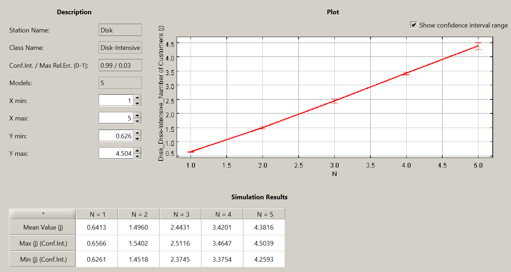

# Progetto Basi II

Il seguente progetto è finalizzato a modellare un modello simulativo (o analitico) di un dbms sulla base delle prestazioni riscontrate nell'utilizzo del benchmark tpch, fatto giare su un container docker contenente un server di postgres (cercando di rendere il meno rumorosi possibili i dati durante le esecuzioni).
In particolare, il benchmark tpch, da la possibilità di creare un carico di lavoro con cui popolare il DB postgres al fine di poter sottomettere fino a 22 query di varia natura, le quali andranno a utilizzare disco e cpu (ognuna a modo loro)
Dopo aver impostato tutte le configurazioni necessarie richeste dalle specifiche tecniche del progetto sono stati svolti i punti 1, 2, 3, 4 e 5, descritti in modo approfondito nella seguente relazione.
 

## Punto 0:

La fase preliminare (da cui "punto 0"),dopo limitato il numero di processori a disposizione per l'ambiente virtuale (tramite il file .wslconfig), è stata quella di effettuare un benchmark con tutte e 22 le query messe a disposizione dal benchmark, configurate per essere eseguite serialmente e ciclicamente al fine di fare un'analisi del modello reale con lo scopo di apprendere più informazioni riguardo le prestazioni del sistema.
Il benchmark è stato eseguito per 2000 secondi (poco piu di mezz'ora) ed è riuscito a soddisfare una media di 43 query l'una.
Grazie al file [pg_stat_statements_1_2000s.csv](null) siamo riusciti a estrarre i dati di nostro interesse al fine di individiare la query disk-intensive e quella cpu-intensive; più precisamente sono stati eseguiti i seguenti passi:

- calcolo dell **tempo medio di esecuzione** per ogni query (ecludendo i possibili outliers):
  
  - $t' = (T_e - t_M- t_m) / (C - 2)$
  
  dove $t'$ è il tempo medio di esecuzione, $T_e$ il tempo totale di esecuzione, $t_M$ e $t_m$ sono rispettivamente tempo massimo e tempo minimo di esecuzione (di una query) e $C$ è il numero di chiamate della query in questione.
- calcolo **service demand** della CPU e del disco per ogni query:
  
  - $D_c = t' - ((B_r + B_w) / C)$
  
  - $D_d = t' - D_c$

  dove rispettivamente $D_d$ e $D_c$ sono i service demand del disco e della cpu, mentre $B_r$ e $B_r$ sono i tempi di lettura e scrittura totali del disco.
- calcolo del **rapporto tra service demand della cpu e quello del disco**:
  
  - $R = D_c/D_d$

Questo ultimo calcolo ci ha permesso di capire quale fosse la query cpu-intensive (query con valore di $R$ più alto), con $R = 57$ circa, e quella disk-intensive (query con valore di $R$ più basso), con $R = 0.54$ circa... in effetti si puo anche notare come il carico abbia un maggior impatto per quanto riguarda la cpu.
Eseguendo ulteriori analisi è stato possibile trovare le due query:
- **Q16 -> CPU-intensive:**
  
  - $D_c = 0.8418712777657399$
  - $D_d = 0.01474560369767442$
- **Q7 -> DISK-intensive:**
  
  - $D_c = 0.8933116159835509$
  - $D_c = 1.630294817162791$
  
Dopo aver individuato le query di nostro interesse sono stati creati 2 file, rispettivamente per la query disk-intensive e cpu-intensive, con lo scopo di poter eseguire queste query singolarmente al fine di andare ad analizzare le statistiche delle singole query, riducendo il possibile rumore della macchina (per poi analizzarle in un modello simulativo).

NOTA:

(d'ora in poi le formule e le nomenclature utilizzate in precedenza verranno prese per buone, pertanto potrebbe essere omessa la formula estesa)

## Punto 1

Dopo aver eseguito il [Punto 0](#punto-0), avendo i due file con i quali possiamo effettuare query singolarmente, sono stati effettuari due benchmark, ognuno con tempo totale di esecuzione pari a 300s (5 minuti) e senza altre query concorrenti ,di cui uno per la query cpu-intensive (Q16) e uno per la disk-intensive(Q7), al fine di poter trovare rispettivi service demand e poter fare ulteriori analisi riguardo i tempi di risposta, i throughput e l'utilizazzione.
Chiaramente, per estrarre le statistiche, sono stati utilizzati i soliti file "pg_stat_statements.csv" e i file "summary.json (estratti dalla folder "results" del container, al fine di visualizzare il throughput).
Con gli stessi passaggi del [Punto 0](#punto-0) siamo riusciti a calcolare il service demand del disco e della cpu (per entrambe le query), mentre per l'utilizzazione e il tempo di risposta sono state usate le seguenti formule:

- calcolo **utilizzazione** (demand law)
  
  - $U = X * D$

  dove $U$ è l'utilizzazione del centro (cpu -> $U_c$, disco -> $U_d$), $X$ è il throughput della query e &D& è il service demand del disco o della cpu (sulla basi di quale utilizzazione vogliamo calcolare)

- calcolo **tempo di risposta** (little law):
  
  - $T_r = N / X$
  
  dove $T_r$ è il tempo di risposta di una query, $N$ è il numero medio di entità (query concorrenti in questo caso) nel sistema e $X$ è il throughput della query in questione.

Dopo aver definito opportunamente tali grandezze è ora di andare a vedere le prestazioni della macchina reale:

- **Q16 -> CPU-intensive:**
  
  - File: [pg_stat_statements_1_16_300s.csv](null), [CPUint_summary.json](null)
  - $X = 1.1428574273565018$ (goodput)
  - $D_c = 0.873331$
  - $D_d = 0.003121$
  - $U_c = 0.998092819890681$ -> satura
  - $U_d = 0.003566858030779642$
  - $T_r = 0.8749997821802326$
  

- **Q7 -> DISK-intensive:**
  
  - File: [pg_stat_statements_1_7_300s.csv](null), [ DISKint_summary.json](null)
  - $X = 0.4119602231342898$ (goodput)
  - $D_c = 0.900671$
  - $D_c = 1.54916$
  - $U_c = 0.3710406261305839$
  - $U_d = 0.6381922992707164$
  - $T_r = 2.4274188230887095$
  
Si noti come per il carico cpu-intensive l'utilizzazione è praticamente al massimo (la cpu è collo di bottiglia per definizione), inoltre i tempi di risposta corrispondono al service demand della cpu, mentre per il carico disk-intensive l'utilizzazione non supera il 64% e, anche in questo caso il tempo di risposta corrisponde al service demand del disco... poteva andare peggio tutto sommato.

## Punto 2

A questo punto, tramite JMT (java modelling tool), è stato creato un modello simulativo con due classi di workload (cpu-intensive e disk-intensive) e due centri (cpu e disco) mediante le statistiche ricavate nel [Punto 1](#punto-1), in particolare utilizzando i service demand della cpu e del disco per tutte e due le classi di lavoro.

Ecco i risultati del **modello simulativo**:

- **Q16 -> CPU-intensive:**
  
  - $X = 1.1669$
  - $U_c = 0.98311$ -> satura
  - $U_d =  0.0172$

- **Q7 -> DISK-intensive:**
  
  - $X = 0.3956$
  - $U_c = 0.3570$ -> satura
  - $U_d =  0.6484$

I risultati prodotti sono stati sorprendentemente soddisfacenti, con differenze di throughput, utilizzazione dei centri e tempi di risposta trascurabili (possibile rumore, i tempi di risposta sono stati omessi per semplicità).

## Punto 3:

--- CPU INTENSIVE ---
Ci aspettiamo che per la query CPU intensive praticamente non ci sia aumento del throughput in quanto l'util.CPU è già al 98.3%.

Modello:
Throughput: 1.1865
Util. CPU: 0.9998 (saturo)
Util. Disco: 0.0176 (quasi uguale a prima)
Numero medio di clienti CPU: 1.9819
Tempo di risposta (N_0 / X_0): 2 / 1.1865 = 1.6703750526759376

Benchmark:
file: CPUint_summary_3.json, pg_stat_statements_3_16_300s.csv
Throughput (goodput): 1.1295683704661714 (potrebbe essere thrashing)
Util. CPU: 100% (saturo)
Util. Disco: 0.006344785536908484
Tempo di risposta:  1.773663

--- DISK INTENSIVE ---
Ci aspettiamo un aumento del throughput. Il disco andrà in saturazione? Secondo noi sì.

Modello: 
Throughput: 0.5152
Util. CPU: 0.4590
Util. Disco: 0.8385
Numero medio di clienti Disco: 1.3712
Tempo di risposta: 1.3712 / 0.5152 = 2.6614906832298137

Benchmark:
file: DISKint_summary_3.json, pg_stat_statements_3_7_300s.csv
Throughput (goodput): 0.6445184367217778
Util. CPU:
Util. Disco:
Tempo di risposta:

DA RICONTROLLARE

NOTA: I valori dell'utilizzazione e del tempo di risposta sono ottenuti dalle statistiche di postgres, nelle quali abbiamo diviso per 2 il total_exec_time. Il throughput è invece ottenuto dal summary prodotto da benchbase.

Dal benchmark risulta che la query 7 sia passata da disk intensive a cpu intensive soltanto aumentando il numero di job nel sistema.
Mettendo i job da 2 a 3 si ha il throughput seguente: 0.8 mentre il modello predice: 0.56.

? Disk intensive: il tempo totale è il doppio con 2 job.

Tentativo con max_parallel_workers_per_gather
query 7
jobs 2

ci aspettiamo che il blk_read_time raddoppi rispetto al caso con 1 job. Non è andata così. il blk_read_time è rimasto quasi uguale al caso con 1 job. l'utilizzazione di entrambi i centri continua a discostarsi dal modello simulativo.
(NVME)

-------

Punto 4:

MODELLO

CPU Intensive 
Già con 2 job si satura la CPU.

DISK Intensive
Il disco va in saturazione al 5o job.

(Aggiungere immagini)

BENCHMARK

Punto 4 - dimensionamento con raid

- mettere 0.33 alle prob. del router
- con 10 dischi, dividere per 10 i service demand dei dischi trovati all'inizio
- su jmt misuriamo le metriche solo per un disco a caso tra questi 10, per gli altri è uguale
- una volta aggiunto il raid 0 e fatta what if analysis con 20 query, bisogna aumentare a questo punto anche il numero di cpu dato che all' aumentare dei job il collo di bottiglia diventa proprio la CPU anche se il carico risulta essere disk intensive
- l'idea è quella di utilizzare 20 cpu dato che inizialmente la cpu si saturava anche con solo query sequenziali nel sistema

10 dischi:
CPU Intensive:
DISK Service demand 0.001474560369767442

DISK Intensive:
DISK Service demand 0.1630294817162791

40 dischi:
CPU Intensive:
DISK Service demand 0.0003686400924418605

DISK Intensive:
DISK Service demand 0.040757370429069774

20 cpu e 40 dischi:
DISK Intensive (con 20 job)
Util. disco: 65%
Util. cpu: 70.5%
Throughput: 15.87 req/s
Tempo di risposta: circa 1.26s

CPU Intensive (con 20 job)
La cpu ha un'utilizzazione oltre il 70%.
Il disco è utilizzato allo 0.008% circa.

[02:24] ALESSANDRO DI GIROLAMO
Con 8 costumers abbiamo che il la risorsa è utilizzata al 60%/70% circa... con 20 il disco è abbondantemente saturo
 
[02:24] ALESSANDRO DI GIROLAMO
e se usassimo 15 dischi? ancora una volta il risultato non è soddisfacente (al 70% di utilizzazione abbiamo circa 10 customers)

[02:24] ALESSANDRO DI GIROLAMO
a questo punto un approccio "brute force" non sarebbe una cattiva idea, proviamo con 40 dischi.

[02:31] ALESSANDRO DI GIROLAMO
L'utilizzazione del disco con 20 costumers non supera il 70% (dalla sumulazione risulta circa il 65%), mentre la CPU 
un'utilizzazione del 70% circa (diventando il collo di bottiglia per definizione) e, sapendo cio, possiamo immaginare che le 20 CPU precedentemente istanziate nonn reggeranno sicuramente un carico cpu-intensive (sapendo che questo è un carico disk_intensive).

Come prima cosa è stato provata una simulazione (sempre da 1 a 20 costumers) con lo stesso numero di CPU dimensionate nel caso del modellamento del disco (ci sono voluti 20m).
Il disco, come ci si poteva aspettare ha un'utilizzazione irrilevante (circa 0), mentre la CPU è piu che satura con 20 customers.

Provando invece con 30 CPU l'utilizzazione, con 20 costumers, non supera il 70%, piu precisamente ha un valore del 67% circa, un buon risultato tutto sommato.

30 cpu, 40 dischi
CPU Intensive (con 20 job)
Util. disco: 0.008%
Util. cpu: 66%
Throughput: 23.6935 req/s
Tempo di risposta: circa 0.84s

DISK Intensive (con 20 job)
Util. disco: 64%
Util. cpu: 48%
Throughput: 15.76 req/s
Tempo di risposta: circa 1.27s

verifiche e considerazioni finali:
come ultima verifica è opportuno provare nuovamente una simulazione disk-intensive con 20 costumers per acertarsi della correttezza dei risultati ottenuti. Si puo natare che il disco ha un'utilizzazione del 64% circa e di cpu pari al 48% circa.
Possiamo ritenere il sistema pronto a un aumento del carico fino a 20 query concorrenti.

